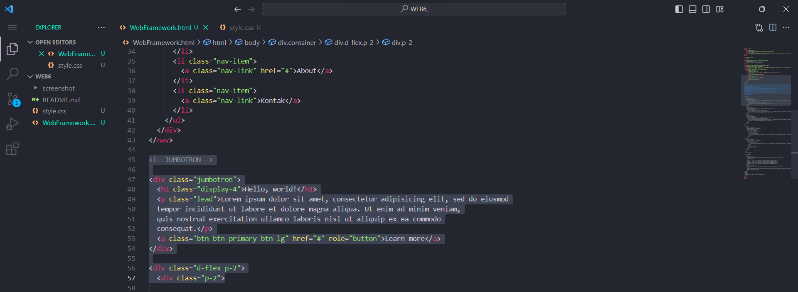
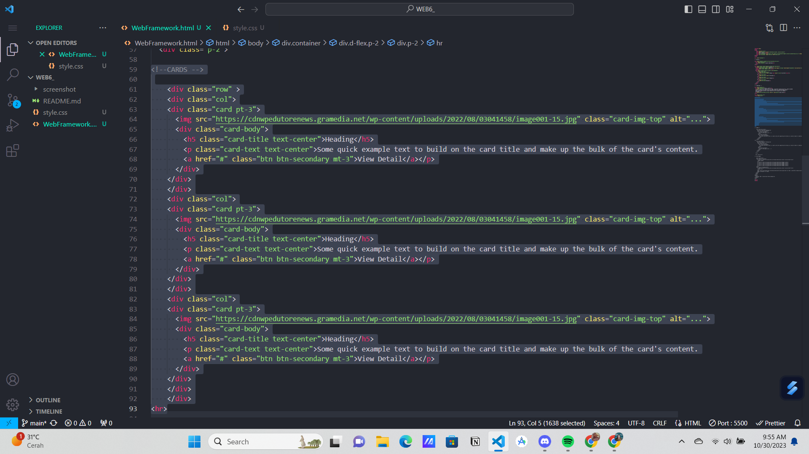

# Tugas Praktikum { Pertemuan ke 7 } 

|**Nama**|**NIM**|**Kelas**|**Matkul**|
|----|---|-----|------|
|Muhammad Ikhsan Fakhrudin|312210019|TI.22.A.2|Pemrograman WEB|

# Web Framework

## Langkah-Langkah Praktikum

Membuka ``text editor`` , di sini saya menggunakan ***Visual Studio Code.***

## Buatlah Layout Web Sederhana Menggunakan CSS Framework (Twitter Bootstrap)

### 1. Copy Link Bootstrap

Buka web https://getbootstrap.com Disini saya memakai Bootstrap 4. Copy atau download CSS & JS Bootstrap , disini saya memilih copy.

### 2. Membuat Navbar

Buat komponen website yang berupa menu. Biasanya diletakkan pada header website.

Untuk mencari Navbar  klik menu documentation  lalu  klik components pada web Bootstrap.

### 3. Menambahkan Jumbotron

Selanjutnya buat jumbotron atau area besar pada Bootstrap, umumnya digunakan untuk menampilkan sebuah infromasi penting.

### 4. Membuat Card (1)

Untuk membuat body konten, saya menggunakan card.

Pertama saya akan membagi kolom menggunakan display flex agar dapat memuat 2 kolom yang nanti akan di isi oleh menu List Group.

### 5. Membuat Card (2)

Buat body konten untuk yg kedua , masih menggunakan card.

### 6. Menambah List Group

Tambahkan widget disamping kanan card.

### 7. Membuat Footer

Bagian akhir tambahkan footer.

***CSS Eksternal :***

## Hasil Akhir

## SELESAI  

